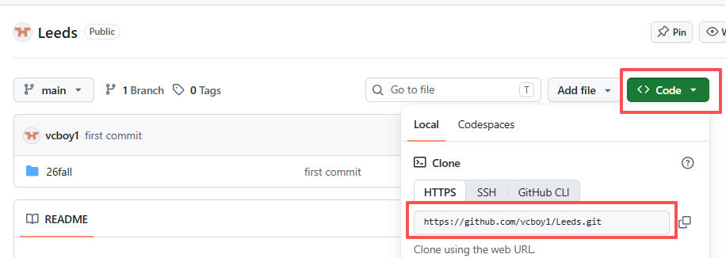
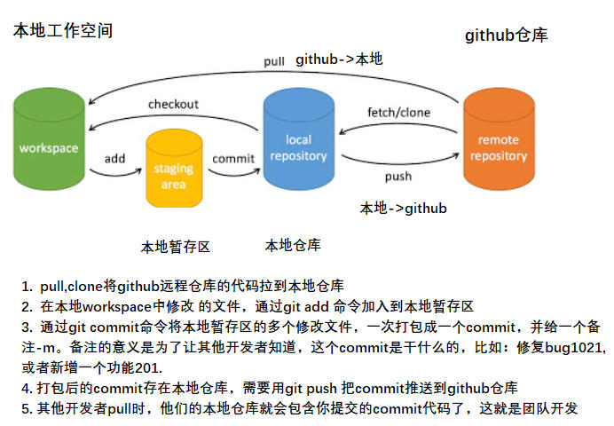
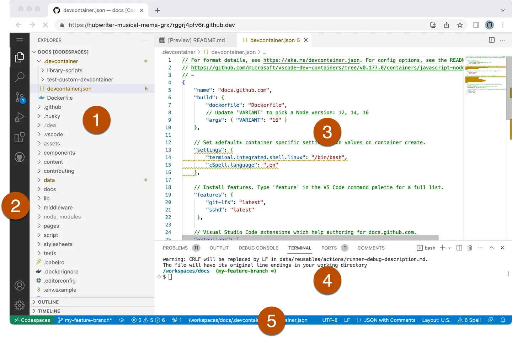
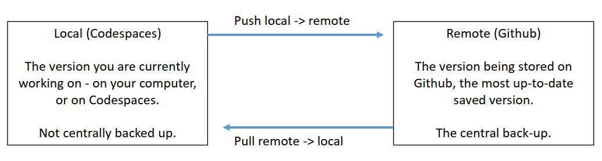

# Week1 Session 1
## 1. Git
    Git is a version control tool(版本控制工具)

### 1.1 Why do we need a version control tool？
**In industry**
+ You are always working in a team
+ You work on the same codebas（代码库）e as other people
+ The codebase may be live(already deployed and running)  
    

**In university** 
+  Working individually or in teams
+  You may be working on university machines or your own
+  Often creating new code
+  You need a secure backup of your work
+  You will break things and want to recover working code!

  
### 1.2 The role(作用) of version control system(git)
+ allow programmers to work concurrently（并行工作） on the same code.
+ allow you to track the history of development.（跟踪开发历史)
+ allow you to restore previous versions (恢复以前的版本)

   
### 1.3 将github仓库clone到本地工作空间(只做一次) ###

    • 如用CodeSpace打开项目，则无需此步骤  
    • 仓库只用clone一次，后续用pull同步  

|  步骤 | 说明  |
|  ----  |----  |
| cd /src  |进入根目录下的src目录 |
| git clone https://github.com/vcboy1/Leeds.git | 将仓库clone到本地的/src目录下，代表仓库的.git路径获取方式见下图|
|cd Leeds|clone成功后，进入本地底仓目录Leeds|
|git log|查看修改历史|  
|

  
  

### 1.4 配置提交记录里的作者身份 ###
    • 如用CodeSpace打开项目，则无需此步骤  
    • 这是全局设置，只做一次，设置后无需再设置  
|  步骤 | 说明  |
|  ----  |----  |
| git config --global user.name "Xinyuan Li" |设置提交者名字 |
| git config --global user.name "利兹邮箱"  |设置提交者邮箱 |  

### 1.5 日常操作：从github仓库拉取最新代码到本地工作空间 ###
    • 在每次开发前，首先要pull最新代码，将本地工作空间的代码和远程仓库同步，保证开发的是最新的代码。  
|  步骤 | 说明  |
|  ----  |----  |
| git pull origin |从远程origin仓库拉取最新代码到本地工作空间 |

### 1.6 日常操作：从本地工作空间的修改推送到github仓库 ###
工作原理  

|  步骤 | 说明  |
|  ----  |----  |
| git pull origin |从远程origin仓库拉取最新代码到本地工作空间 |
|  |做正常的开发工作 |
| git add .  |stages(暂存) your changes – it tells Git that you have done some work you would like to save|
| git commit -m "xxx"| bundles(打包) these changes into one ‘commit’（提交）  you can go back to previous commits, so this is basically a way of creating a save point.(你可以回滚到以前的提交，这是一个创建还原点的方法，一个commit就是一个还原点|
| git push origin| sends these changes back to the remote Github server(把commit打包的changes push到github仓库中)|

### 1.7 扩展阅读 ###
[Git命令行基本操作](https://www.runoob.com/git/git-basic-operations.html)   
[Git  GUI基本操作](https://docs.github.com/zh/codespaces/the-githubdev-web-based-editor) 

## 2. GitHib
    • A git-based platform for version control
    • Also has lots of cool open source projects!
    • We’re going to be using it for everything  

## 3. Codespaces ##
    • integrated development environment inside Github（IDE:集成开发环境)

### 3.1 Open a Codespaces  ###

### 3.2 What is a Codespace?  ###
    

    • A Codespace is a **linux virtual machine** running in the cloud.         (运行在云上的linux虚拟机)   

    • It is created with the current ‘main’ branch from the Github repository.（基于main分支创建）    

    • You can run, edit and write new code inside the Codespace.              （在Codespace中编写运行代码)     

    • However your work is only saved locally inside the Codespace.            (代码保存在Codespace虚拟机中)     

    • You can push your work to save it permanently                           （想永久化保存代码，需push到github仓库中)
    
       
   
### 3.3 Why Codespace  ###      
    • Some of you are programming on Windows machines, some on Mac,and some on Linux.  

    • Codespaces means you all work on the same machines. (意味着你们都在同一台机器上工作) 
    which is helpful to ensure your work is portable  

    • Being able to work on Linux is also essential. (能够在Linux上工作也很重要)   
    if you work as a developer, it is almost guaranteed that you will use either linux or another Unix-based system (such as a Mac).  

### 3.4 扩展阅读 ###
[GitHub Codespaces 快速入门](https://docs.github.com/zh/codespaces/quickstart)     

## 4. Linux Shell(command line) ##
## 4.1 directory Command（目录命令) ##
|  command |Action  | desc  |
|  ----  | --  |----  |
| mkdir [dir_name]  |增| makes a new (empty) named directory, (eg. mkdir myCode) |
| rmdir [dir_name]  |删|  remove an empty named directory, (eg. rmdir myCode),只有空目录才可以删除，目录中有文件和子目录则失败|
| pwd               |查|tells you your current directory (folder) |
| ls                |查|  list everything in the current directory (files or directories) |
| cd [dir_name]     |改|  move into a named directory (eg. cd myCode) |
| cd ..             |改|  move up one directory level |  

## 4.2 fle Command（文件命令) ##
|  command   | Action  |desc  |
|  ----  |--  | ----  |
| touch [file_name]         |增| makes a new (empty) file (eg. touch myFile.txt) |
| cp [src_file] [dest_file] |增| copy src_file to dest_file|
| rm [file_name]            |删| remove a file (eg. rm myFile.txt) |
| cat [file_name]           |查| display the content of the text file |
| rename [file1] [file2]  |改| reame file1 to file2|

## 4.3 扩展阅读 ##
[Linux命令大全](https://www.runoob.com/linux/linux-command-manual.html)  

# Week1 Session 2