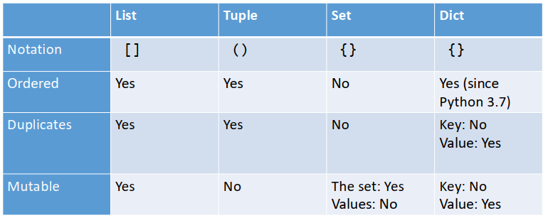
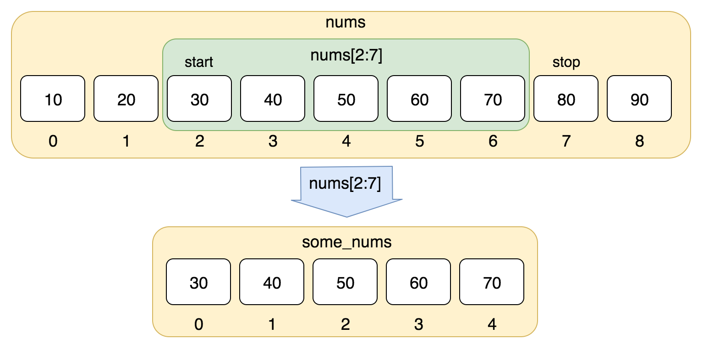
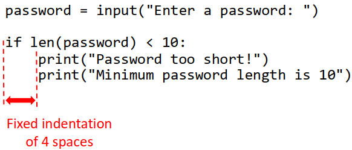

# 1. Python Collections
## 1.1 Outline
| Collection                                                             | 中文            | Featrue                                                                                      | Example                          | 初始化                                                 |
| ---------------------------------------------------------------------- | --------------- | -------------------------------------------------------------------------------------------- | -------------------------------- | ------------------------------------------------------ |
| [List](https://www.runoob.com/python3/python3-list.html)               | 列表（数组)     | • ordered, one-dimensional array                                                             | 储存多个输入数据                 | nums = [10, 20, 30, 40, 50]                            |
| [Tuple](https://www.runoob.com/python3/python3-tuple.html)             | 元组（只读数组) | • ordered, one-dimensional readonly array                                                    | 存储枚举数据(Alevel等级)         | colors = （'red', 'green', 'blue'）                    |
| [Set](https://www.runoob.com/python3/python3-set.html)                 | 集合            | • unordered collection of unique items<br>• 数学概念集合                                     | 计算交集、并集、补集、差集的场合 | set1 = {1, 2, 3, 4}                                    |
| [Dictionaries](https://www.runoob.com/python3/python3-dictionary.html) | 字典            | • a collection of key: value pairs<br>• unordered collection<br>• 根据名字查值，就像英汉字典 | 根据快递编号找快递               | dict1 = {'Name': 'Runoob', 'Age': 7, 'Class': 'First'} |


## 1.1 List（列表：数组)
   • A list is an ordered, one-dimensional array of objects  
   • Create a list using [ ], with a ',' to separate each item of data  
   
### 1.1.1 初始化
    • List items are usually of the same type, but they don't have to be
```python
numbers = [4, 2, 7, -1]              # 数组内存放单一类型的元素
things = [-1.2, "duck", 4, "Q"]      # 数组内存放多种类型的元素
data = []                            # 空数组
```

### 1.1.2 List Indexing
    • The first item is at index 0 and we count from there
```python
things = [-1, "duck", 4, "Q"]      
print(f"{things[1]},{things[2]}")    # duck,4

things[0] ="lxy"
print(f"{things[0]}")                # lxy
```

### 1.1.3 slice(切片)
    • 注意：索引是从0开始的，list中的第2个元素的索引是1  


```python
list1 = ['Google', 'Runoob', "Zhihu", "Taobao", "Wiki"]

# 倒数第二个，倒数第一个
print (f"{list1[-2]},{list1[-1]}")      # Taobao,Wiki

# 从索引1开始（包含）截取到索引4（不包含）
print (f"list1[1:4]: {list1[1:4]}")     # ['Runoob', 'Zhihu', 'Taobao']

# 从索引1开始（包含）截取到倒数第二个（不包含）
print (f"list1[1:-2]: {list1[1:-2]}")   # ['Runoob', 'Zhihu']

```

### 1.1.4 Modifying Lists
| Method              | Purpose                                                                        |
| ------------------- | ------------------------------------------------------------------------------ |
| append(item)        | Adds an item at the end of the list                                            |
| insert(index, item) | Adds an item at the specified position                                         |
| pop(index)          | Removes the item at the specified position (or last item if no index provided) |
| remove(item)        | Removes the first item that has the specified value                            |
| count(item)         | Returns number of occurrences of specified item in the list                    |
| index(item)         | Returns the index of the first item that has the specified value               |
| clear()             | Removes all the items from the list                                            |
| reverse()           | Reverses the order of the list                                                 |
| sort()              | Sorts the items in the list into their natural order                           |

```python
nums = [3, 1, 4, 1, 5]

# append(x): 末尾添加元素
nums.append(9)
print(nums)        # [3, 1, 4, 1, 5, 9]

# insert(i, x): 在索引 i 处插入 x
nums.insert(0, 2)
print(nums)        # [2, 3, 1, 4, 1, 5, 9]

# pop(): 删除并返回最后一个元素；pop(i) 删除并返回索引 i 处元素
last = nums.pop()
print(last)        # 9
print(nums)        # [2, 3, 1, 4, 1, 5]

first = nums.pop(0)
print(first)       # 2
print(nums)        # [3, 1, 4, 1, 5]

# remove(x): 删除第一个值为 x 的元素；不存在会 ValueError
nums.remove(1)
print(nums)        # [3, 4, 1, 5]

# count(x): 统计 x 出现次数
print(nums.count(1))  # 1

# index(x): 返回第一个值为 x 的索引；不存在会 ValueError
print(nums.index(4))  # 1

# reverse(): 原地反转
nums.reverse()
print(nums)        # [5, 1, 4, 3]

# sort(): 原地升序排序；sort(reverse=True) 降序
nums.sort()
print(nums)        # [1, 3, 4, 5]

nums.sort(reverse=True)
print(nums)        # [5, 4, 3, 1]

# clear(): 清空列表
nums.clear()
print(nums)        # []
```

### 1.1.4 Uses
    • Their dynamic nature makes them very flexible（灵活)
    • Manipulation(修改) is easy, using list methods
    • It is easy to iterate(遍历) over contents of a list
    • They can be used to represent different kinds of data structure – e.g., stacks and queues

### 1.1.5 扩展阅读
https://www.runoob.com/python3/python3-list.html 


## 1.2 Tuples(元组：只读数组)  
    • A list is ordered, one-dimensional readonly array of objects    
    • Create a list using ( ) with a ',' to separate each item of data
   
### 1.2.1 初始化
```python
tup1 = ()
album = ("Taylor Swift", "Folklore", 2020)
```

### 1.2.2 Operations
```python
t = (1, "lxy", 3) # init tuple
(a, b, c) = t     # unpacks tuple into variables（将tuple中的值按顺序解包到a,b,c中
print(t[0],b,c)          # what is printed here?  1, lxy  3

#这样的操作是禁止的，因为tuple是只读的，不能修改
t[1] = 2
```


### 1.2.3 Indexing and Slice  
    • 和list一样，用[]访问，使用方法是一样的
```python
tup1 = (-1, "duck", 4, "Q")      
print(f"{tup1[1]},{tup1[2]}")    # duck,4
``` 

```python
tup1 = ('Google', 'Runoob', "Zhihu", "Taobao", "Wiki")

# 倒数第二个，倒数第一个
print (f"{tup1[-2]},{tup1[-1]}")      # Taobao,Wiki

# 从索引1开始（包含）截取到索引4（不包含）
print (f"{tup1[1:4]}")               # ['Runoob', 'Zhihu', 'Taobao']

# 从索引1开始（包含）截取到倒数第二个（不包含）
print (f"{list[1:-2]}")              # ['Runoob', 'Zhihu']

```

### 1.2.4 扩展阅读
https://www.runoob.com/python3/python3-tuple.html


## 1.3 Set(数据集合)  
    •  集合模仿数学集合，因此它们在集合论（计算交并补集)的情况下很有用
    •  无序、无重复collection

### 1.3.1 初始化
```python
set1 = {1, 2, 3, 4}  
set2 = set([4, 5, 6, 7])  # 将list转为set
set3 = set((4, 5, 6, 7))  # 将tuple转为set
```
### 1.3.2 去重
    removal of duplicates from a list
```python
data = ["apple", "orange", "apple", "grape"]
unique_data = list(set(data))  # ["apple", "orange","grape"]
```    

### 1.3.3 Operations
| Method                     | Desc       | Purpose                                                              |
| -------------------------- | ---------- | -------------------------------------------------------------------- |
| add(item)                  | 加入元素   | Adds specified item to the set                                       |
| discard(item)              | 删除元素   | Removes specified item from the set                                  |
| union(setB)                | 求并集     | Returns new set containing elements of the set and those of setB     |
| intersection(setB)         | 求交集     | Returns new set containing elements of the set that are also in setB |
| difference(setB)           | 就差集     | Returns new set containing elements of the set that are not in setB  |
| symmetric_difference(setB) | 求对称差集 | Returns the complement of intersection(setB)                         |

```python
A = {1, 2, 3, 4}
B = {3, 4, 5, 6}
U = {1, 2, 3, 4, 5, 6, 7, 8}  # 全集，用于“补集”

# 交集：A 和 B 都有
print(A & B)                  # {3, 4}
print(A.intersection(B))      # {3, 4}

# 并集：A 或 B 有
print(A | B)                  # {1, 2, 3, 4, 5, 6}
print(A.union(B))             # {1, 2, 3, 4, 5, 6}

# 差集：在 A 但不在 B
print(A - B)                  # {1, 2}
print(A.difference(B))        # {1, 2}

# 对称差集：在 A 或 B，但不同时在两者
print(A ^ B)                  # {1, 2, 5, 6}
print(A.symmetric_difference(B))  # {1, 2, 5, 6}

# 补集：Python set 没有内置“补集”运算符，通常相对全集 U 取差集
print(U - A)                  # A 在 U 中的补集：{5, 6, 7, 8}
print(U - B)                  # B 在 U 中的补集：{1, 2, 7, 8}
```
### 1.3.4 扩展阅读
https://www.runoob.com/python3/python3-set.html

## 1.4 Dictionaries(字典)
    • A dictionary is a collection of key: value pairs（键值对)
    • We look up values using the key, rather than an index(用key找value，而不是用index)
    • Value associated with a key can be replaced（key关联的value可以被替换)
    • Pairings of key & value can be added or removed（键值对可以被添加、删除)
    • 查找算法复杂度O(1)

### 1.4.1 初始化
```python
prices = {"apple": 21, "orange": 30, "banana": 45}
data = {}
```
### 1.4.2 Find  Replace  Add/Remove key-value pair
```python
prices = {"apple": 21, "orange": 30, "banana": 45}

print(prices["apple"]) # prints 21
prices["apple"] = 25   # find value for key 'apple'
print(prices["apple"]) # prints 25

print(prices["kiwi"]) # what happens here?
prices["kiwi"] = 53   # adds new key-value p

prices["lxy"] = 99    # add a  key-value对
print(prices["lxy"])  # prints 99

prices.pop("lxy")     # remove a  key-value对
```

### 1.4.3 Dictionary Operations
| Method   | Purpose                                                          |
| -------- | ---------------------------------------------------------------- |
| clear()  | Removes all key-value pairs from the dictionary                  |
| get(key) | Returns the value associated with the specified key              |
| items()  | Returns a sequence of tuples containing keys & associated values |
| keys()   | Returns a sequence containing the dictionary’s keys              |
| pop(key) | Removes the key-value pair for the specified key                 |
| values() | Returns a sequence of the dictionary's values                    |
```python
d = {"name": "Tom", "age": 18, "city": "Beijing"}

# get(key, default): 取值；key 不存在时返回 default，不会报错
print(d.get("name"))          # Tom
print(d.get("gender", "N/A")) # N/A

# keys(): 返回所有键
print(d.keys())               # dict_keys(['name', 'age', 'city'])

# values(): 返回所有值
print(d.values())             # dict_values(['Tom', 18, 'Beijing'])

# items(): 返回所有键值对，常用于遍历
print(d.items())              # dict_items([('name', 'Tom'), ('age', 18), ('city', 'Beijing')])

for k, v in d.items():
    print(k, "=", v)
# name = Tom
# age = 18
# city = Beijing

# pop(key, default): 删除并返回指定 key 的值；不存在且没给 default 会 KeyError
age = d.pop("age")
print(age)                    # 18
print(d)                      # {'name': 'Tom', 'city': 'Beijing'}

gender = d.pop("gender", "N/A")
print(gender)                 # N/A

# clear(): 清空字典
d.clear()
print(d)                      # {}
``` 

## 1.5 Combining Collections
    我们可以结合这些基本的集合类型来创建更复杂的数据结构：
    • 列表可以包含元组或其他列表
    • 与字典键关联的值可以是列表
    • Tuples可以用作字典的关键字
    通过精心设计，这使我们能够对非常广泛的现实世界数据进行建模

## 1.6 Useful Functions
|                                 | list | tuple | set | dict |
| ------------------------------- | ---- | ----- | --- | ---- |
| len(collection)                 | √    | √     | √   | √    |
| min(collection)                 | √    | √     | √   |      |
| max(collection)                 | √    | √     | √   |      |
| for v in collection<br>print(v) | √    | √     | √   | √    |


# 2. Boolean expressions
## 2.1 Boolean Type
    • These values have special names: True and False
    • Note: no quotes (these are not strings)

## 2.2 Comparison operator
| Operator | Name                     |
| -------- | ------------------------ |
| =        | equal to                 |
| !=       | not equal to             |
| >        | greater than             |
| >=       | greater than or equal to |
| <        | less than                |
| <=       | less than or equal to    |
 
## 2.3 Boolean Operators
| Expression | Result                                           |
| ---------- | ------------------------------------------------ |
| x and y    | True if both x and y are True, otherwise False   |
| x or y     | True if x or y or both are True, otherwise False |
| not x      | True if x is False, False if x is True           |

## 2.4 in Operators
    • The in operator can be used to construct boolean expressions that test whether an item is part of a string or a collection

```python
"x" in "hello"             # False
"he" in "hello"            # True
3 in [1, 2, 3, 4]          # True
"x" in {"a", "b", "c"}     # False
"c" in {"a": 1, "b": 2, "c": 3} # True (tests keys)
```

# 3. Selection Statements(IF)
## 3.1 Basic If Statement
    if boolean-expression:  
        Block of code to execute if result is True
    else:
        Block of code to execute if result is False
        

## 3.2 Adding More Branches
    if first-boolean-expression:
        Block of code to execute if first result is True
    elif second-boolean-expression:
        Block of code to execute if second result is True
    else:
        Block of code to execute if neither result is True

```python
score = int(input("input math  score:"))
if  score >= 90 :
    print('A*')
elif score >= 80 :
    print('A')
elif score >= 70 :
    print('B')
elif score >= 60 :
    print('C')
else:
    print('D')
```        

## 3.3 其他类型强制转换为boolean类型
| Boolean | Result                                                         |
| ------- | -------------------------------------------------------------- |
| True    | Any non-zero number (e.g., -5, 100, 4.287)                     |
|         | • Non-empty string (e.g., "hello", " ")                        |
|         | • Non-empty collection (e.g., [1,2,3], {"age": 42})            |
| False   | • 0 and 0.0                                                    |
|         | • None (Python’s version of the null value in other languages) |
|         | • Empty string ("")                                            |
|         | Empty collection (e.g., [], {})                                |

```python
name = input("Enter your name: ")
if not name:
    print("You didn't enter anything!")
```

## 3.4 Match Statements
```python
match status:
        case 400:
            return "Bad request"
        case 404:
            return "Not found"
        case 418:
            return "I'm a teapot"
        case _:
            return "Something's wrong with the internet"
```

```python
match day:
    case "Monday" | "Wednesday":
        print("Go to gym")

    case "Tuesday" | "Thursday":
        print("Take a walk")

    case "Friday" | "Saturday" | "Sunday":
        print("Do nothing")

    case _:
        # _ matches any value
        print("Error! Invalid day!")
```

## 3.5 扩展阅读
### How To Think Like a Computer Scientist
• Chapter 7: Selection

### 更多match语法的例子：  
https://docs.python.org/3/tutorial/controlflow.html#match-statements
