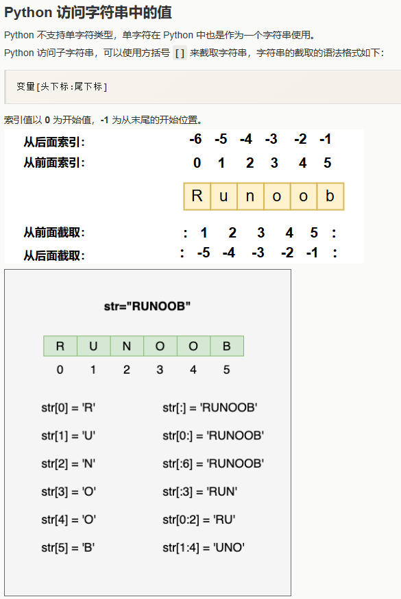

# Week1 Session2
## 1. Python
### 1.1 简介
    • A high-level programming language
       o  meaning more like natural (spoken) language than machine code  

    • Considered to be easy to work with
        o less verbose (ie. less code) than other common languages
        o easy-to-read error messages  

    • a common tool in many areas
        o data science
        o natural language processing
        o AI

### 1.2 History
    • Over 30 years old    

    • Current version Python 3 about 15 years old    

    • The move from Python 2 to Python 3 was controversial  
        • Why?    

    • Python 4 is not planned

### 1.3  Run Python Program in  Codespaces 
    
|步骤| 说明|
| --- | --- |
|start Codespces |Oepn a Codespaces from the code menu|
|git pull|Pull the latest code from GitHub repository to local space|
|mkdir week1.1/session2  |create a new subfolder|
|cd week1.1/session2  |enter session2 folder|
|touch test1.py  |create a new python file|
|  |add some python code|
|python test1.py| run |
    

    • Python is an interpreted language  

    • When we type ‘python test1.py’
        • We are invoking the Python interpreter(解释器) with the input source code file  

    • When we run the interpreter a separate application
        – the PVM (Python virtual machine):
            o Reads the code line by line
            o Compiles it to machine-level instructions (byte-code)
            o Executes it  

## 2. Python syntax(语法)
     • Python recognises（识别） 2 forms of indentation（缩进）
        • <tab> space
        • 4 spaces

### 2.1 Variables（变量)
     • python变量不需要事先申明，可以直接使用
     • 在运行中，python变量可以改变数据类型，参见2.1.4

#### 2.1.1 Variables Type
|简单数据类型| 说明|举例|
| --- | --- | --- |
|int |整数| v= 1|
|float |浮点| v= 1.2|
|bool |boolean| v= True|
|complex|复数| v= 4+3i|
|String|字符串,下标从0开始| v= "hello"|


|复合数据类型| 说明|举例|
| --- | --- | --- |
|List |列表（数组)| v=  ['Google', 'Runoob', 1997, 2000]|
|Tuple |元组| v= ('Google', 'Runoob', 1997, 2000)
|Set |集合| v= {1, 2, 3, 4}  |
|Dictionary|字典| v= {'Name': 'Runoob', 'Age': 7, 'Class': 'First'}|

#### 2.1.2 Determine data type
```python  
>>> a = 111
>>> isinstance(a, int)
True
```
#### 2.1.3 rules about variables name
    •  no spaces
    •  no symbols
    •  always start with a letter
    •  don’t use reserved words (for example ‘input’ or ‘print’)

#### 2.1.4 dynamically typed(动态类型)
    •  The variable can change type through assignment
    •  The converse is called static typing  

```python  
>>> a = 111
>>> a = "speed"
>>> print(a)
>>> speed
```
### 2.1.5 strongly typed(强类型)
```python  
>>> a = input("enter a number1")
>>> b = input("enter a number2")
>>> print(a+b)
>>> error: Type conversion error
```
[Python3 基本数据类型](https://www.runoob.com/python3/python3-data-type.html)
    

#### 2.1.6 Variables 类型转换
---
```python  
y = int(2.8) # y 输出结果为 2
z = int("3") # z 输出结果为 3
```

```python  
x = float(1)     # x 输出结果为 1.0
z = float("3")   # z 输出结果为 3.0
```

```python 
y = str(2)    # y 输出结果为 '2'
z = str(3.0)  # z 输出结果为 '3.0'
z = str(True)  # z 输出结果为 'True'
```

```python 
print(bool(1))          # 输出: True
print(bool(0))          # 输出: False
print(bool(-1))         # 输出: True
print(bool(""))         # 输出: False
print(bool("hello"))    # 输出: True
```
[Python3 基本数据类型转换](https://www.runoob.com/python3/python3-type-conversion.html)

### 2.2 String类型
#### 可以使用引号 ' 或 " 来创建字符串
```python 
var1 = 'Hello World!'
var2 = "Runoob"
```

#### 在需要在字符中使用特殊字符时，python 用反斜杠 \ 转义字符。
```python 
print("\\")    # 输出\
print("\"")    # 输出"
print("\n")    # 输出换行
```

#### Python字符串更新（无法直接修改，必须用拼接的方式生成新的字符串)
```python 
var1 = 'Hello World!'
print ("已更新字符串 : ", var1[:6] + 'Runoob!')
```

#### Python字符串运算符
|操作符| 说明|举例|
| ---- | --- | --- |
|+ |字符串连接| a + b 输出结果： HelloPython |
|* |重复输出字符串|	a*2 输出结果：HelloHello |
|[]| 通过索引获取字符串中字符 |	a[1] 输出结果 e|
|[ : ]|	截取字符串中的一部分，遵循左闭右开原则，str[0:2] 是不包含第 3 个字符的。|	a[1:4] 输出结果 ell|
|in	|成员运算符 - 如果字符串中包含给定的字符返回 True|	'H' in a 输出结果 True
|not in|成员运算符 - 如果字符串中不包含给定的字符返回 True|	'M' not in a 输出结果 True|
  
#### 内存布局  


#### f-string  

    f-string 格式化字符串以 f 开头，后面跟着字符串，字符串中的表达式用大括号 {} 包起来，它会将变量或表达式计算后的值替换进去
```python 
name = 'Runoob'
print(f'Hello {name}')  # 'Hello Runoob'

x = 1
print(f'{x+1}')   # '2'

```   
#### function
| 序号 | 方法 | 描述 |
|---|---|---|
| 1 | `count(str, beg=0, end=len(string))` | 返回 str 在 string 里面出现的次数，如果 beg 或者 end 指定则返回指定范围内 str 出现的次数 |
| 2 | `find(str, beg=0, end=len(string))` | 检测 str 是否包含在字符串中，如果指定范围 beg 和 end，则检查是否包含在指定范围内，如果包含返回开始的索引值，否则返回 -1 |
| 3 | `index(str, beg=0, end=len(string))` | 跟 find() 方法一样，只不过如果 str 不在字符串中会报一个异常 |
| 4 | `isalnum()` | 检查字符串是否由字母和数字组成，即字符串中的所有字符都是字母或数字。如果字符串至少有一个字符，并且所有字符都是字母或数字，则返回 True；否则返回 False |
| 5 | `isalpha()` | 如果字符串至少有一个字符并且所有字符都是字母则返回 True，否则返回 False |
| 6 | `isdigit()` | 如果字符串只包含数字则返回 True，否则返回 False |
| 7 | `islower()` | 如果字符串中包含至少一个区分大小写的字符，并且所有这些（区分大小写的）字符都是小写，则返回 True，否则返回 False |
| 8 | `isnumeric()` | 如果字符串中只包含数字字符，则返回 True，否则返回 False |
| 9 | `isspace()` | 如果字符串中只包含空白，则返回 True，否则返回 False |
| 10 | `istitle()` | 如果字符串是标题化的（见 title()）则返回 True，否则返回 False |
| 11 | `isupper()` | 如果字符串中包含至少一个区分大小写的字符，并且所有这些（区分大小写的）字符都是大写，则返回 True，否则返回 False |
| 12 | `len(string)` | 返回字符串长度 |
| 13 | `lower()` | 转换字符串中所有大写字符为小写 |
| 14 | `lstrip()` | 截掉字符串左边的空格或指定字符 |
| 15 | `replace(old, new [, max])` | 把字符串中的 old 替换成 new，如果 max 指定，则替换不超过 max 次 |
| 16 | `rfind(str, beg=0, end=len(string))` | 类似于 find() 函数，不过是从右边开始查找 |
| 17 | `rindex(str, beg=0, end=len(string))` | 类似于 index()，不过是从右边开始 |
| 18 | `rstrip()` | 删除字符串末尾的空格或指定字符 |
| 19 | `split(str="", num=string.count(str))` | 以 str 为分隔符截取字符串，如果 num 有指定值，则仅截取 num+1 个子字符串 |
| 20 | `splitlines([keepends])` | 按照行（'\r'、'\r\n'、'\n'）分隔，返回一个包含各行作为元素的列表，如果参数 keepends 为 False，不包含换行符，如果为 True，则保留换行符 |
| 21 | `startswith(substr, beg=0, end=len(string))` | 检查字符串是否是以指定子字符串 substr 开头，是则返回 True，否则返回 False。如果 beg 和 end 指定值，则在指定范围内检查 |
| 22 | `strip([chars])` | 在字符串上执行 lstrip() 和 rstrip() |
| 23 | `upper()` | 转换字符串中的小写字母为大写 |
| 24 | `zfill(width)` | 返回长度为 width 的字符串，原字符串右对齐，前面填充 0 |

---
[Python3 字符串](https://www.runoob.com/python3/python3-string.html)


### 2.3 input/output
---
```python  
>>> str = input("enter a number") # 输入类型是string
>>> num = int(str)                # 类型转换
```
```python  
>>> name = "lxy"
>>> print("hello world! " + name) # hello world lxy
>>> print(f"hello world! {name}") # hello world lxy, f""表示字符串内部有变量需要替换值，{}内是要替换值的变量
```
```python  
>>> pi = 3.1415926
>>> print(f"{pi:.3f}") # 3.142, .3f保留三位小数
```
[Python3 输入和输出](https://www.runoob.com/python3/python3-inputoutput.html)

### 2.4 try...exception
---
```python 
try:
    num1 = int(input('Enter your number: '))
    num2 = int(input('Enter your number: '))
    answer = num1 + num2
    print(f'{num1} + {num2} = {answer}')
except:
    print('Please enter numbers only.')
```
```python 
import sys

try:
    f = open('myfile.txt')
    s = f.readline()
    i = int(s.strip())
except OSError as err:
    print("OS error: {0}".format(err))
except ValueError:
    print("Could not convert data to an integer.")
except:
    print("Unexpected error:", sys.exc_info()[0])
    raise  # 不捕获异常，重新抛出异常
```    

[Python3 错误和异常](https://www.runoob.com/python3/python3-errors-execptions.html)

### 2.5 Math
|操作符| 说明|举例|
| --- | --- | --- |
|** |Power| 2**3 = 8 |
|// |integer division – 整数除法取商| 8 // 3 = 2|
|% |modulo division - 整数除法取余数 | 9 % 2 = 1  |
