# 1. Translate numerical data from one format to another
## 1.1 十进制和任意进制互转
### 1.1.1 任意进制转十进制（16->10 | 2->10)
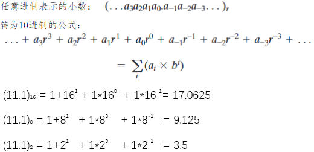

### 1.1.2 十进制转任意进制（10->16 | 10->2)
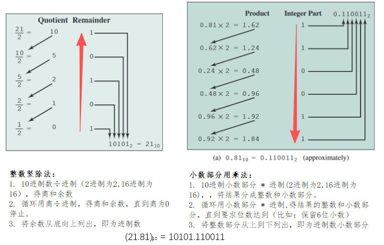

    • Show 8039 = 0x1F67
        1. Divide 8039 by 16 to get 502, remainder 7. Rightmost digit is 7.
        2. Divide 502  by 16 to get 31,  remainder 6. Next digit is 6.
        3. Divide 31   by 16 to get 1,   remainder 15.Next digit is F (15).
        4. Divide 1    by 16 to get 0,   remainder 1. Last digit is 1.
    Reverse order to get 1F67.
    
## 1.2 十六进制系统与二进制互转
### 1.2.1 Converting hexadecimal to binary（16->2)
    • Convert each hex digit to 4-bit binary and concatenate (from left to right)
      每一个16进制数转为4个二进制数，从左到右连接起来   
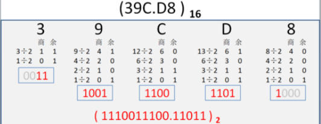      

### 1.2.2 Converting binaryto hexadecimal（2->16)
    • Split binary into groups of 4 bits (from right) and convert each group of 4 bits to a hex digit  
      将二进制数分成4位组（从右开始），并将每组4位转换为十六进制数字  
  

# 2. Binary Fractions: Radix Point(二进制小数：小数点)
## 2.1 Decimal & Binary Fractions（小数)
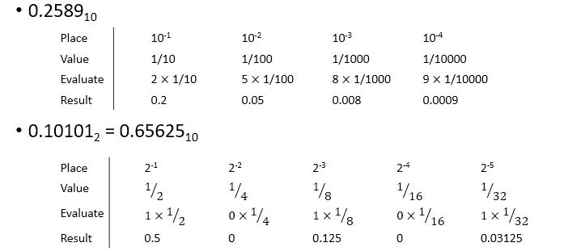   

    • 以基数10表示的数字可能无法以基数2精确表示。  
    • 但以基数表示的所有分数都可以以10为底表示。

## 2.2 Converting decimal fractions to binary(转换10进度小数到二进制)
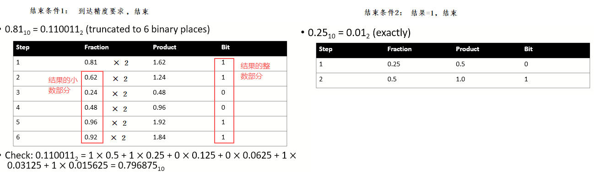

## 2.3 Mixed number conversion(整数.小数)
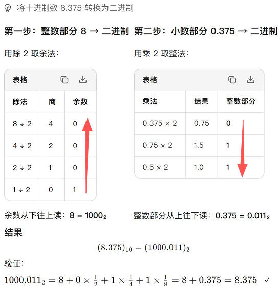

# 3. Integer Representation(整数表示法)

    在二进制数系统中，任意数可以表示为：
    . 数字0和1
    . 减号（表示负数）
    . 周期或基数点（对于有小数成分的数字）
    为了计算机存储和处理的目的，我们没有减号和基点的特殊符号,只能使用二进制数字（0,1）表示数字  
      
|类别|表示法|中文|表示范围|
|---|---|---| ---|  
|无符号表示法 不能表示负数| Unsigned Integer|无符号表示法| 0 - 2^16|
||BCD|2进制编码10进制表示法|0 - 9999 |
|有符号表示法 能表示负数|Sign-Magnitude Representation|符号幅度表示法|−(2^15−1) - +(2^15−1) |
||Tows Complement Representation|二进制补码表示法|  −(2^15) - +(2^15−1)     |

## 2.1 Unsigned Integer(无符号表示法)
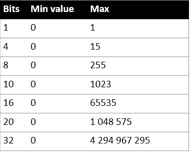    

    • An unsigned integer represent values from 0 to 2^𝑛−1
    • 𝑛 number of bits for representation
    • 没有符号位，因此不能表示负数
    • Unsigned  Integer用16bits来表示范围，Signed Integer用15bits来表示范围，1bit表示Sign

## 2.2 Binary Coded Decimal(无符号BCD表示法)
|||
|---|---|
|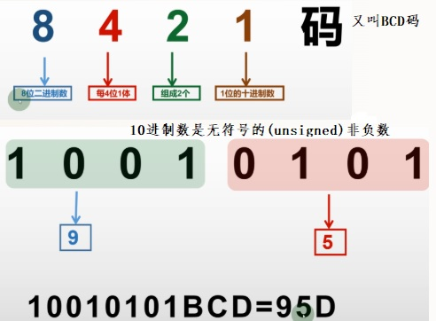|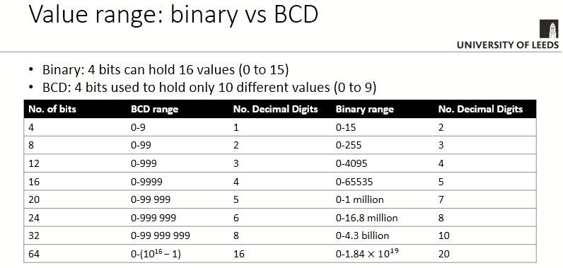|
## 2.2 Sign-Magnitude Representation(有符号幅度表示法)
  

    • 在一个n位字中，最右边的 n-1 位表示了整数的幅度。最左边的位视为符号位。
    • 如果符号位为 0，则数字为正；如果符号位为 1，则数字为负。  

缺点：  
  

    • 进行加法和减法运算时，需要同时考虑数字的符号及其相对大小
    • 对于数字“0”有两种不同的表示方式：
            + 0 = 00000000
            - 0 = 10000000  
    
## 2.3 Twos Complement Representation(有符号二进制补码表示法)
### 10进制->2进制补码
|符号|转换方法|例子|
|---|---|---|
|+ 和 0 | • 符号位为0，数字按10进制转2进制存放 | +3 =0000 0011 |
|- |  1. 符号位为0，数字按10进制转2进制存放 2. 取反+1 |-3   0000 0011  1111  1101 |
  
     
### 2进制补码->10进制
|符号位|转换方法|例子|
|---|---|---|
|0 | • 符号位为0，符号为+；数字按2进制转10进制 | 0000 0011 = +3 |
|1 |  1. 符号位为1，符号为- 2. -1取反 3. 数字按2进制转10进制加负号  |1111  1101  -  0000 0011   -3|

    • 二进制补码表示法也是将最高位作为符号位，因此很容易判断一个整数是正数还是负数。这种表示法与符号幅度表示法的区别在于，其他位的解释方式不同.
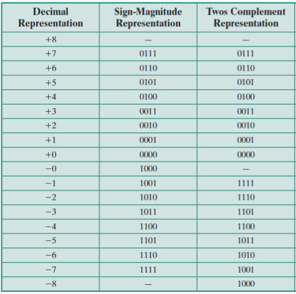      

## 2.4 Binary Arithmetic
### 1. Binary Addition(二进制加法)
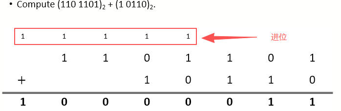   

### 2. Binary Multiplication(二进制乘法)
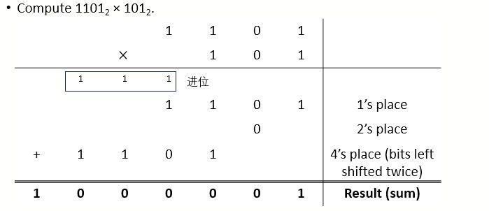   

