# 1. Translate numerical data from one format to another
## 1.1 十进制和任意进制互转
### 1.1.1 任意进制转十进制（16->10 | 2->10)

### 1.1.2 十进制转任意进制（10->16 | 10->2)

    • Show 8039 = 0x1F67
        1. Divide 8039 by 16 to get 502, remainder 7. Rightmost digit is 7.
        2. Divide 502  by 16 to get 31,  remainder 6. Next digit is 6.
        3. Divide 31   by 16 to get 1,   remainder 15.Next digit is F (15).
        4. Divide 1    by 16 to get 0,   remainder 1. Last digit is 1.
    Reverse order to get 1F67.
    
## 1.2 十六进制系统与二进制互转
### 1.2.1 Converting hexadecimal to binary（16->2)
    • Convert each hex digit to 4-bit binary and concatenate (from left to right)
      每一个16进制数转为4个二进制数，从左到右连接起来   
      

### 1.2.2 Converting binaryto hexadecimal（2->16)
    • Split binary into groups of 4 bits (from right) and convert each group of 4 bits to a hex digit  
      将二进制数分成4位组（从右开始），并将每组4位转换为十六进制数字  
  
-----

# 2. Binary Fractions: Radix Point(二进制小数：小数点)
## 2.1 Decimal & Binary Fractions（小数)
   

    • 以基数10表示的数字可能无法以基数2精确表示。  
    • 但以基数表示的所有分数都可以以10为底表示。

## 2.2 Converting decimal fractions to binary(转换10进度小数到二进制)

## 2.3 Mixed number conversion(整数.小数)

# 3. Integer Representation(整数表示法)

    在二进制数系统中，任意数可以表示为：
    . 数字0和1
    . 减号（表示负数）
    . 周期或基数点（对于有小数成分的数字）
    为了计算机存储和处理的目的，我们没有减号和基点的特殊符号,只能使用二进制数字（0,1）表示数字  
      
|类别|表示法|中文|表示范围|
|---|---|---| ---|  
|无符号表示法 不能表示负数| Unsigned Integer|无符号表示法| 0 - 2^16|
||BCD|2进制编码10进制表示法|0 - 9999 |
|有符号表示法 能表示负数|Sign-Magnitude Representation|符号幅度表示法|−(2^15−1) - +(2^15−1) |
||Tows Complement Representation|二进制补码表示法|  −(2^15) - +(2^15−1)     |

## 3.1 Unsigned Integer(无符号表示法)
    

    • An unsigned integer represent values from 0 to 2^𝑛−1
    • 𝑛 number of bits for representation
    • 没有符号位，因此不能表示负数
    • Unsigned  Integer用16bits来表示范围，Signed Integer用15bits来表示范围，1bit表示Sign

## 3.2 Binary Coded Decimal(无符号BCD表示法)
|||
|---|---|
|||

## 3.3 Sign-Magnitude Representation(有符号幅度表示法)
  

    • 在一个n位字中，最右边的 n-1 位表示了整数的幅度。最左边的位视为符号位。
    • 如果符号位为 0，则数字为正；如果符号位为 1，则数字为负。  

缺点：  
  

    • 进行加法和减法运算时，需要同时考虑数字的符号及其相对大小
    • 对于数字“0”有两种不同的表示方式：
            + 0 = 00000000
            - 0 = 10000000  
-----    
## 3.4 Twos Complement Representation(有符号二进制补码表示法)
### 3.4.1 十进制->二进制补码
|符号|转换方法|例子|
|---|---|---|
|+ 和 0 | • 符号位为0，数字按10进制转2进制存放 | +3 =0000 0011 |
|- |  1. 符号位为0，数字按10进制转2进制存放 2. 取反+1 |-3   0000 0011  1111  1101 |
  
     
### 3.4.2 二进制补码->十进制
|符号位|转换方法|例子|
|---|---|---|
|0 | • 符号位为0，符号为+；数字按2进制转10进制 | 0000 0011 = +3 |
|1 |  1. 符号位为1，符号为- 2. -1取反 3. 数字按2进制转10进制加负号  |1111  1101  -  0000 0011   -3|

### 3.4.3 Benefits
    • One representation of zero   
    • Arithmetic more uniform with signs（算术符号更加统一）
    • Negating is easy
        Flip bits of representation
        Then add 1 to least significant bit (rightmost)  

      

### 3.4.4 Overflow（溢出）
Overflow情景说明：   

    Consider adding 6 to 7 in 4-bit 2’s complement
        • 6 is 0110, 7 is 0111
        • Sum by binary addition is 1101
        • This is -3!

Overflow rule:   

     • If two numbers are added, and they are both positive or both negative, then overflow occurs if and only if the result has the opposite sign
       同正同负相加，结果符号位与加数符号位不同时，溢出发生(如上例: 6，7为正，结果-3为负)。

     • MSB gives sign: 0 positive integer, 1 negative integer

### 3.4.5 Range of Numbers
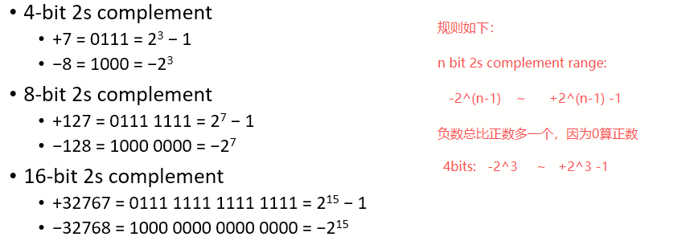  

### 3.4.6 Addition and Subtraction
    • Addition
        Normal binary addition
        If either both numbers are positive or both negative, then a change in the sign bit means overflow and the result should not be used  

    • Subtraction
        a − b = a + (−b)
        Take the complement and add

-----

### 3.4.7 Binary Arithmetic
#### 1. Binary Addition(二进制加法)
   

#### 2. Binary Multiplication(二进制乘法)
   
  
-----------

# 4. Floating-Point Representations(浮点表示法)
## Outline
|Representations|desc|precision|Format|Bais(指数偏移)|
|---|---|---|---|---|
|Fixed Point|小数点位置固定| |符号+固定整数位+固定指数位： 1m.n|
|Floating Point|小数点位置不固定 | 64 bits double precision| 符号+指数+位数： 1 + 11 + 52 |+1023|
|| |32 bits single precision| 符号+指数+位数： 1 + 8 + 23 |+127|
|| |16 bits half precision| 符号+指数+位数： 1 + 5 + 10 |+15|

## 4.1 Scientific Notation（科学计数法)
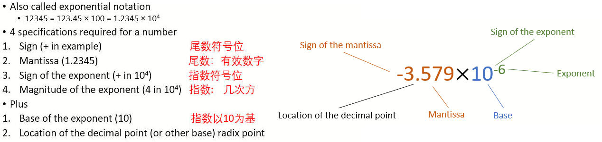

### 4.1.1 Precision(精度：有效位数)
    • The number of digits in the mantissa(尾数) is the precision of the number.  

    Example:
        1.2345 × 10^4 is 5 digits of precision

### 4.1.2 Normalising Binary Fractions（规格化二进制小数）
    • Shift radix point(移动小数点) left or right until we have a number of form 1.xxxxxx
    • The number of shifts is the power of 2 to multiply by
    
        E.g., 1101.011
            • Shift point three places to the left to get 1.101011
            • Hence, 1.101011 × 2^3  

        E.g., 0.001101
            • Shift point three places to the right to get 1.101
            • Hence,  1.101 × 2^(−3)

    •  指数符号正负不用背，和10进制规则一样 
        E.g., 100.2
              1.002  × 10^(2)  因为100.2 -> 1.002，数变小了，所以指数要乘回去，为+

        E.g., 0.002
              2     × 10^(-3)  因为0.002 -> 2，数变大了，所以指数要除回去，为-    

## 4.2 Fixed Point（定点小数表示法：小数点的位置是固定的）
    • Could use fixed point format to store binary fractions
    
    • E.g.  fixed point format
        1 bit for sign
        𝑚 bits for integer part (before the point)
        𝑛 bits for fractional part (after the point)
        𝑚+𝑛+1 bits in total
        Designated Q𝑚.𝑛
    
    • Can represent numbers from ±2^(−𝑛) (0 in integer part, all zeroes other than rightmost bit) to ≈±2^𝑚 (all ones in integer part, all ones in fractional part)
    
    • Fixed point numbers are used in some embedded systems that do not have floating-point arithmetic units  
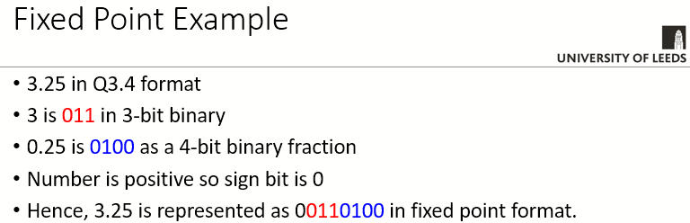

## 4.3 Floating Point （浮点小数表示法：小数点的位置是浮动的）
### 4.3.1 Format（格式：就是AL学过的mantissa + exponent的表示法）
  

    • Uses normalised binary fraction（规格化表示分数)
    • The format specifies which bits correspond to
        The sign of the mantissa
        The exponent(指数)
        The mantissa(尾数)

### 4.3.2 IEEE标准的二进制浮点数
    • 标准的制定是为了促进程序从一个处理器到另一个处理器的可移植性，并鼓励开发复杂的、面向数字的程序  
    • 标准已被广泛采用，几乎用于所有当代处理器和算术协处理器  
    • IEEE 754-2008涵盖了二进制和十进制浮点表示  

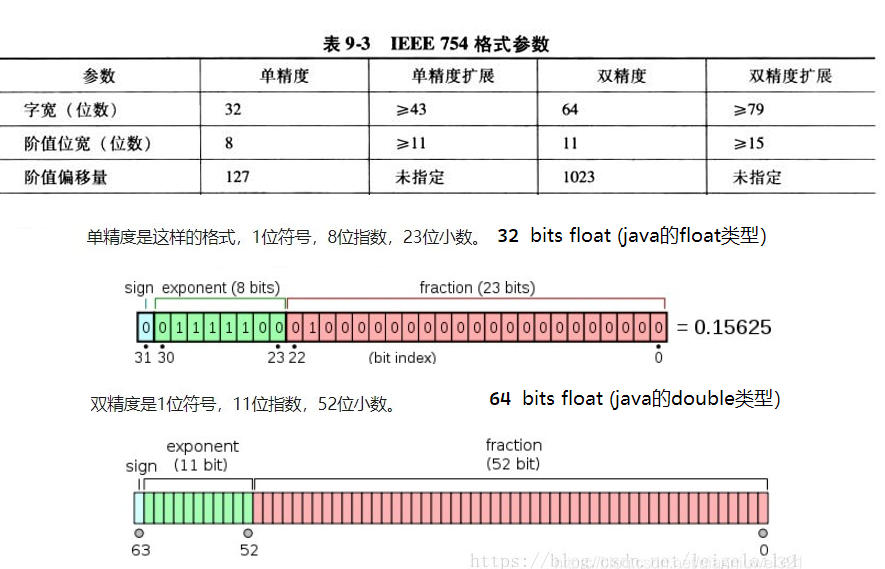

# 5. 32-bit single-precision floating-Point Format（32位单精度浮点小数格式：float）
## 5.1 IEEE 754 Format
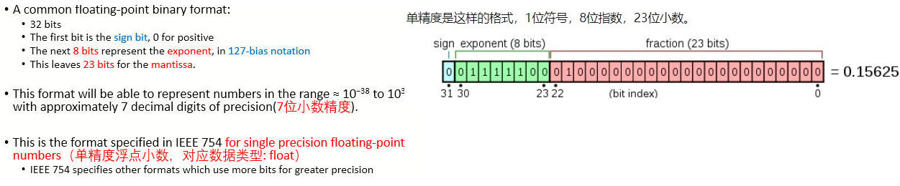  

## 5.2 Bias 127(偏移127) 
    • 在exponent区(8 bits)存放的值 = float真实的指数值 + 127,所以叫Bias 127。
    • 在IEEE 754中，0和255的指数表示特殊值，因此实际范围为-126到+127
|E|存储值|含义|
|---|---|---|
|0|（全 0）|0 或非规格化数（真值固定视为 −126）|
|1 ~ 254|正常数|存储值 = 真实指数 + 127|
|255|（全 1）|无穷大（M=0）或 NaN（M≠0）|

### 举例
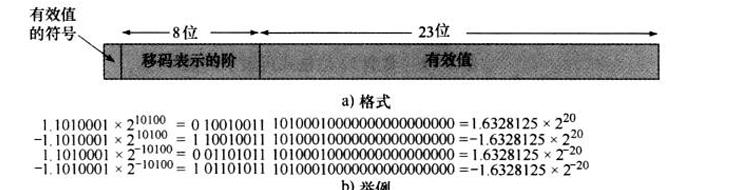
|值|Sign|Exponent|Bias 127|Mantissa|Normalised
|---|---|---|---|---|---|
|1.1010001 * 2^(10100)|0|2进制:10100 = 十进制20|十进制: 20+127=147= 二进制 (1001 0011) |1.1010001 | 1010001(去掉1.) |
|1.1010001 * 2^(-10100)|0|2进制:-10100 = 十进制-20|十进制: -20+127=107= 二进制 (0110 1011) |1.1010001 | 1010001(去掉1.) |

## 5.3 Normalisation（规格化)
    • 浮点数通常是标准化的。
    • 即，调整指数，使尾数的前导位（MSB）为1
    • 因为它总是1，所以不需要存储它。
    • 参见科学记数法，其中数字被标准化为小数点前的一位数字，例如3.123×10^3

##  5.4 Overflow and underflow(上溢和下溢)
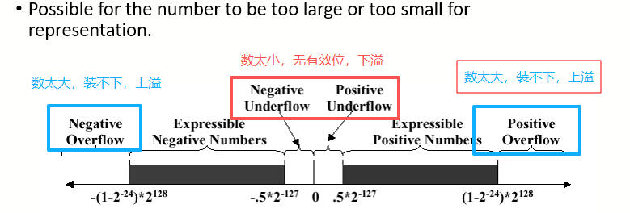

##  5.4 十进制小数转换为32bits单精度float
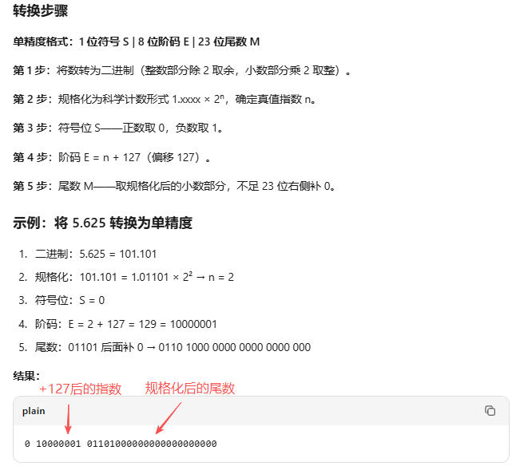

# 6. 16-bit half-precision floating-Point Format（16位半精度浮点小数格式）
## 6.1 Format
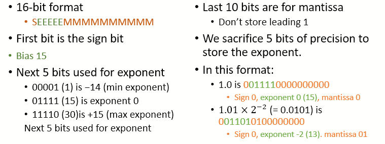

## 6.2 Bias 15(偏移15)
    • 在exponent区(5 bits)存放的值 = float真实的指数值 + 15,所以叫Bias 15。  

## 6.3 Floating Point Addition & Subtraction(半精度浮点加减法)   
### 6.3.1 加减法运算规则
    • Exponent and mantissa分别处理
    • 流程：
        . Exponents of numbers must agree(一样)
            . 对齐小数点（1.0 × 2^(1) 不能和 1.0 × 2^(2)直接相加）
            . 最低有效位数可能会丢失
        . Mantissa对齐加减
        . 结果可能需要重新normalised
  

### 6.3.2 Floating Point Addition
    1. 比较符号位
        若符号不同，则按减法处理。  

    2. 比较指数的大小，确定哪个数更大。  
     
    3. 用大指数减去小指数，得到指数之差d。 
   
    4. 将指数较小的浮点数的尾数对齐：
        a. 在规格化尾数前面补上隐含的整数位 1；
        b. 将该尾数向右移动 d 位。  

    5. 把对齐后的尾数与指数较大的浮点数的尾数相加/减。  
   
    6. 如有必要，对结果进行重新规格化。  
   
    7. 设置结果的符号位：若两个数均为负，则结果符号位设为 1；否则设为 0。

加法:  
-------  
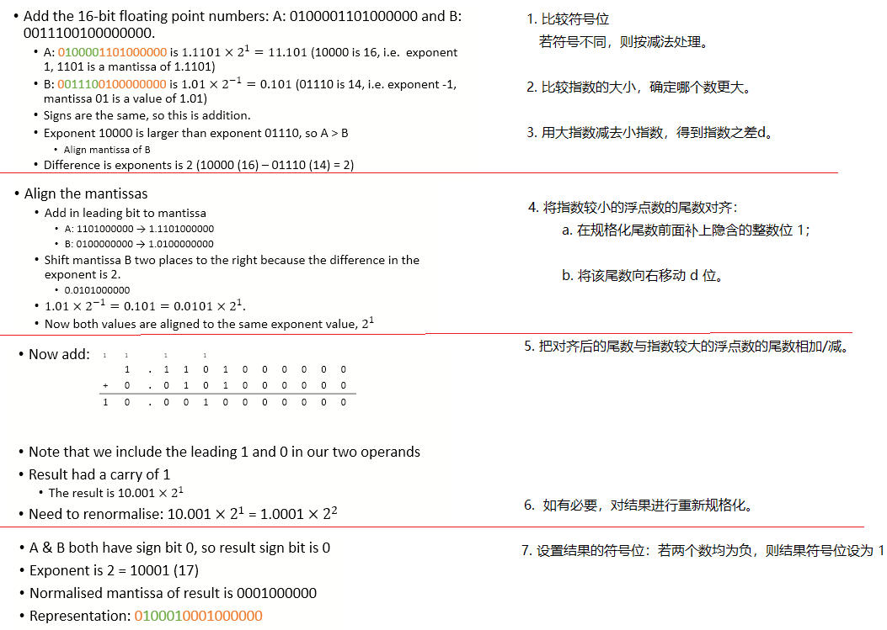  

减法:  
-------  
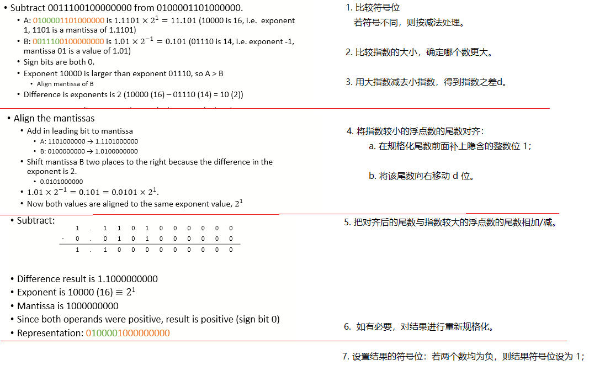 

### 6.3.3 Floating Point Subtraction
    1. 比较符号位
      若符号不同，则按加法处理。  

    2. 比较数值大小（模）
        比较阶码（指数），确定哪个数更大：
            若 |a| > |b|        计算 a − b
            若 |a| < |b|        计算 b − a
        将 b − a 的结果取负

    3. 按加法算法的第 3、4 步进行  
   
    4. 将阶码较小的数对齐后的尾数，从阶码较大的数的尾数中减去   
   
    5. 如有必要，重新规格化   
   
    6. 设置符号位
        若 |a| > |b|     符号与 a 相同
        若 |a| < |b|     符号与 a 相反   

## 6.4 Floating Point Multiplication and division(半精度浮点乘除法)  

### 6.4.1 乘除法运算规则：
    . 尾数（mantissa）：相乘或相除  

    . 指数（exponent）：相加或相减
        . 规格化（normalisation）是必要的，用以恢复小数点的位置并保持结果的精度。  

        . 记住：𝑎^𝑚 × 𝑎^n = 𝑎^(𝑚+𝑛)  

        . 需要调整偏移值（excess value），因为偏移量在相加时被加了两次。  

        . 如果发生溢出（overflow），则停止运算并报错。  

        . 示例：两个指数为 3 的数，用半精度（half precision）格式表示：
            18 + 18 = 36
            由于偏移值 15 被加了两次，需要减去一次：36 − 15 = 21

### 6.4.2 乘法例子
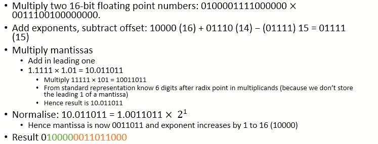

# 7. Numeric Data Representations in Programming Languages（不同编程语言的数据类型）
|Languages|Keyword|Data Representations |
|---|---|---|
|In C/C++/Java|short| is 16-bit two’s complement integer (2 bytes)|
||int| is 32-bit two’s complement integer (4 bytes)|
||long| is 64-bit two’s complement integer (8 bytes)
||float| is single precision IEEE 754 floating point (4 bytes)
||double| is double precision IEEE 754 floating point (8 bytes)|
|Python|Integers| are arbitrary precision integers – stored as a base 2^30 number where each digit is stored as an unsigned 32-bit integer.|
||Floats| are implemented as double precision IEEE 754 floating point|

## 7.1 Byte Order(字节顺序)
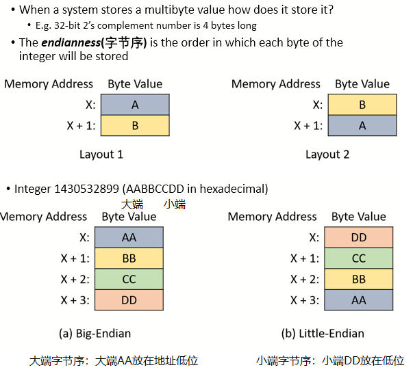
