# Week1 Session1
## Overview
   •  Architecture & Organisation(架构与组织)  
   •  Computer Structure  
   •  History of Computer Hardware  
   •  Von Neumann Architecture（冯诺依曼架构） 
    
## Reading List
[Computer Organisation & Architecture sections 1.1, 1.2 and 1.3 up to Transistors](https://ebookcentral.proquest.com/lib/leeds/reader.action?c=UERG&docID=6824445&ppg=25)    

## 1. Architecture & Organisation(架构与组织)
### 1.1 What is a computer?
    A machine which can:
      • Automatically carry out sequences of arithmetic or logical operations
      • Can be programmed to do so

### 1.2 Architecture(架构:逻辑设计)
    • Logical design of the computer （计算机的逻辑设计） 
    • Defines the attributes of a system visible to the programmer（定义程序员可见的系统属性）  
        Instruction set
        number of bits used to represent various data types
        I/O mechanisms（IO机制)
        techniques for addressing memory(内存寻址)
    • Have a direct impact on the logical execution of a program （对程序的逻辑执行有直接影响）
    • e.g., is there a multiply instruction?（例如，是否有乘法指令？）
    
#### instruction set architecture (指令集架构ISA)
    The ISA defines instruction formats, instruction opcodes, registers, instruction and data memory; the effect of executed instructions on the registers and memory; and an algorithm for controlling instruction execution

### 1.3 Organisation（组织：architecture的物理实现)
    • Physical implementation of the architecture
    • Control signals, interfaces between the computer and peripherals（外围设备）, memory technology used
    • How components are built using electronics
    • How components are arranged and connected in a chip or on a circuit board（电路板) 
    • e.g., is there a hardware multiply unit or is it done by repeated addition?(是否有硬件乘法单元，还是通过重复加法完成)

###  1.4 Architecture & Organisation
    • Companies typically design families of computers which share the same basic architecture,
        e.g. Intel x86, ARM64  

    • This gives code compatibility.
        backwards compatibility(代码向后兼容，即为老架构386写的代码，可以在新架构586上运行).
        Organisation differs between different versions.（不同版本架构不同）
        
我的理解   

    • Architecture定义了CPU的蓝图和规范，它定义CPU的指令和运行规范，是CPU的逻辑视图，这个级别对于程序员是可见的。  

    • Organisation是基于Architecture蓝图的具体实现，它实现CPU的物理细节，是CPU的物理视图，这个级别对于程序员是不可见的。  

    • Architecture就像房屋的设计图纸，而Organisation就像根据蓝图搭建的房屋。一份Architecture可以对应不同的Organisation实现。比如ARM CPU Architecture，就被数以百计的芯片公司（华为、中兴、Google)Organisation。
      
###  1.5 扩展阅读
[X86 CPU 架构发展历史](https://blog.csdn.net/Hide_in_Code/article/details/113799454)  

## 2. Computer Structure(计算机结构)
### 2.1 Structure and Function(结构和功能)
|术语|说明|
| --- | --- |
|Structure|This is the way in which components relate to each other. 组件相互关联的方式|
|Function|The operation of each individual component as part of the structure. 作为Structure组成部分的单个独立组件的操作|

    计算机系统非常复杂，自上而下分析的方法是最清晰、最有效的。我们从计算机的主要组件开始，描述它们的Structure和Function，然后依次进入层次结构的较低层。

### 2.2 Function(Computer Level)
  
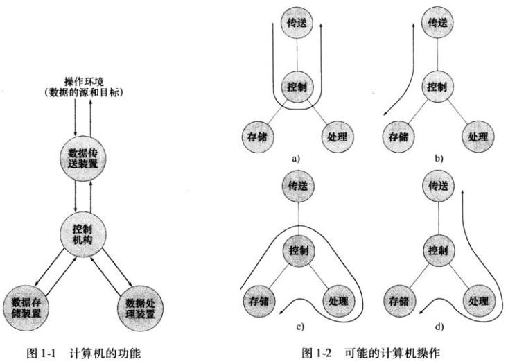
 
    There are four basic functions that a computer can perform: 
    • Data processing
        Data may take a wide variety of forms, and the range of processing requirements is broad 

    • Data storage
        Short-term
        Long-term   

    • Data movement
        Input-output (I/O) - when data are received from or delivered to a device (peripheral) that is directly connected to the computer  

        Data communications – when data are moved over longer distances, to or from a remote device  

    • Control
        A control unit manages the computer’s resources and orchestrates the performance of its functional parts in response to instructions
    

### 2.2 Hierarchical Structure（Computer Level）

    • A computer is a very complex system which is difficult to describe (e.g. x86 manual ∼ 5000 pages).  

    • This is simplified by considering a hierarchical structure.（分级结构简化了这一点）  

    • At each level, the system consists of a set of components and their interrelationships（相互关系）.  

### 2.3 Hierarchical Structure （Single processor computer Level）
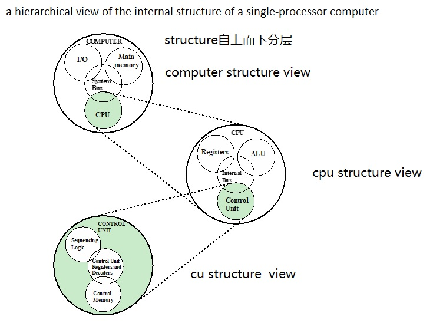 

Structure分级视图|组成Structure的Component|Component Function|
| --- | --- | --- |
|computer级|CPU | •  Controls the operation of the hardware • Interprets and executes instructions from hardware and software|
|| I/O|•  Hardware that allows machine to interact with users and other devices  •  Display, keyboard, printer, network interface card •   Captures input signal as data •  Converts output data to signal hardware understands|
||System Bus| Connects CPU, main memory and I/O|
||Main memory | Stores data and program instructions|
||Co-processors(协处理器)| Some operations have specialised co-processors(GPU)|
|CPU级|Register|Provide storage internal to the CPU|
||ALU|Performs the computer’s data processing function|
||Internal Bus|Some communication mechanism among the control unit, ALU, and registers|
||Control Unit|Controls the operation of the CPU and hence the computer|
|Control Unit级|Sequencing Logic|
||CU Register adn Decoders|
||Control memory|

### 2.5 Hierarchical Structure （Multicore Level)
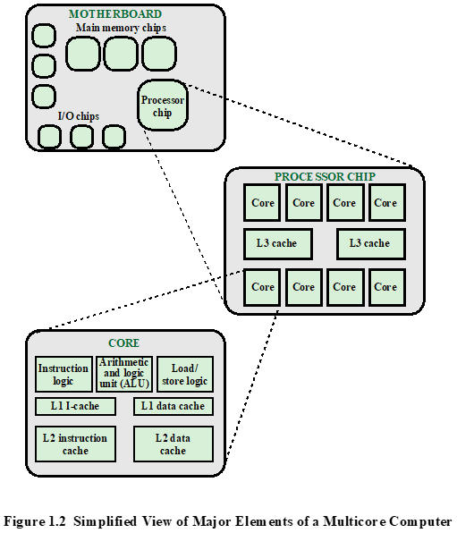
Structure分级视图|组成Structure的Component|Component Function|
| --- | --- | --- |
|Mother Board级|Processor |• A physical piece of silicon(硅) containing one or more cores • Is the computer component that interprets and executes instructions  • Referred to as a multicore processor if it contains multiple cores（如果它包含多个内核，则称为多核处理器）|  
|| I/O||
|| System Bus||
|| Main memory||
|Processor级|Core|• An individual processing unit on a processor chip • May be equivalent in functionality to a CPU on a single-CPU system • Specialized processing units are also referred to as cores |
||Register||
||L3 Cache||
|Core级|Load/Store logic|Manages the transfer of data to and from main memory via cache|
||• L1/2 Cache|• level 1 (L1) closest to the core • additional levels (L2, L3, and so on) farther from the core.|
||Instruction logic|fetching and decoding instructions|  
||ALU||  

    单核系统中的CPU ≈ 多核系统中的Core
  
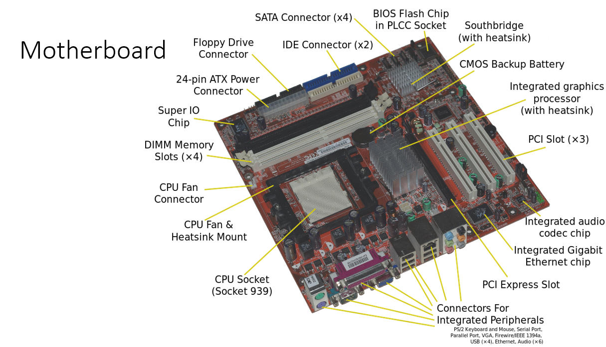
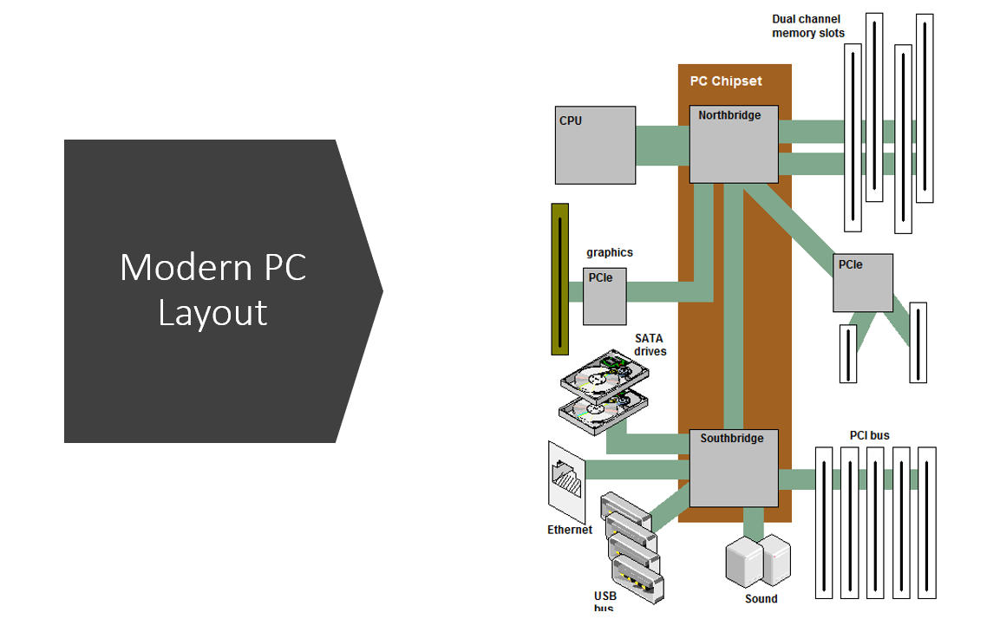
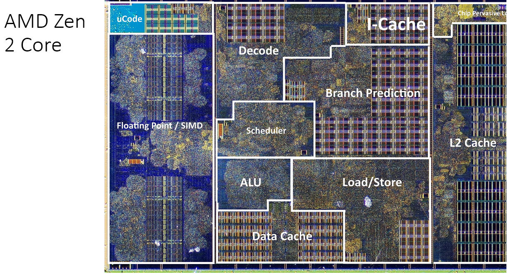
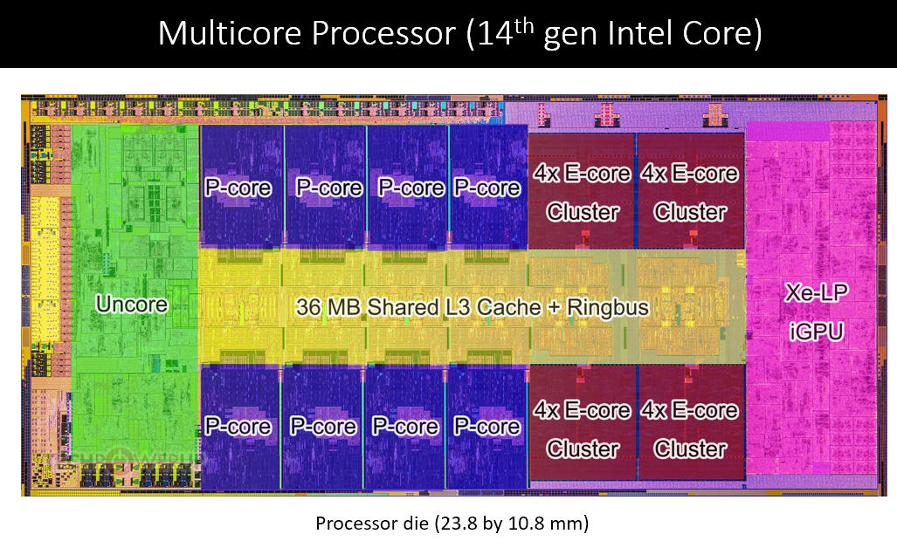

## 3. History of Computer Hardware 
|代际|英文|中文|时间|
| --- | --- | --- | --- |
|第一代|	Electronic valves computer|	电子管计算机|	1946–1958|
|第二代|	Transistor computer	|晶体管计算机|	1958–1964|
|第三代|	Integrated circuit computer|	集成电路计算机	|1964–1971|
|第四代|	Microprocessor computer|	大规模/超大规模集成电路计算机	|1971 至今|   

### 3.1 Electronic valves computer(第一代：电子管计算机)
#### 3.1.1  1st computing devices   

    • Gears                              (齿轮)
    • Decimal                            (十进制)
    • E.g. Babbage’s Analytical Engine   (Babbage分析引擎)
      
#### 3.1.2  In 1930s/1940s   

|||
| --- | --- |
|Z3|electrical|
|Colossus|Electronic valves    电子管 |
|ENIAC|electronic valves  电子管 |  

     Why switches?
     • Switches have two states: open and closed
     • Easy to map logical states: true and false
     • Allows for Boolean logic to be performed
     • Binary arithmetic
     • Storage of data in binary form  

    
#### 3.1.3 Institute for Advanced Studies (IAS) computer   
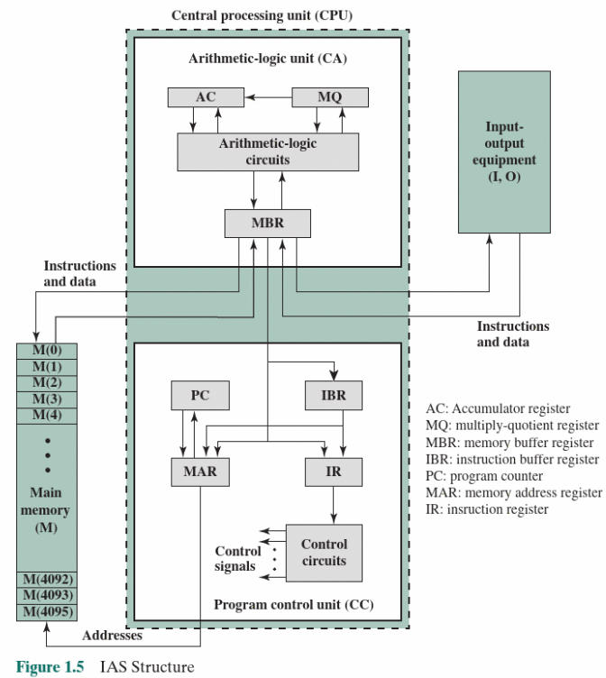  

    • Fundamental design approach was the stored program concept（存储程序概念)
    • Attributed to the mathematician John von Neumann(归功于数学家约翰·冯·诺伊曼)
    • First publication of the idea was in 1945 for the EDVAC
    • Design began at the Princeton(普林斯顿) Institute for Advanced Studies
    • EDVAC completed in 1952
    • Prototype（原型) of all subsequent general-purpose computers (von Neumann Architecture)
    • Machine instructions stored as data (stored program) in memory or read in from I/O.
    
## 3.2 Von Neumann Architecture(冯诺依曼架构计算机，依然是第一代计算机)
    stored program concept  

    If the program can exist in memory together with data in some form, the programming process can be simplified. In this way, computers can obtain instructions by reading programs from memory, and by setting a portion of the memory values, programs can be written and modified.  

    如果程序能够以某种形式与数据一同存在于存储器中,编程的过程就可以简化。计算机就可以通过在存储器中读取程序来获取指令,而且通过设置一部分存储器的值就可以编写和修改程序。这个思想被称为“存储程序概念”,这是Von Neumann Architecture的核心思想

### 3.2.1 Four linked components
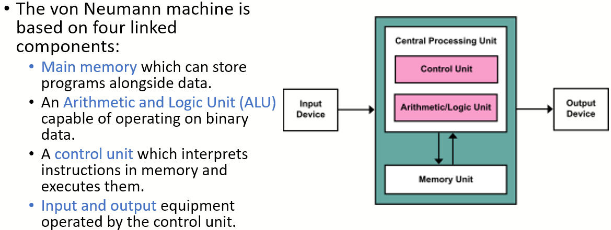  

### 3.2.2 Register
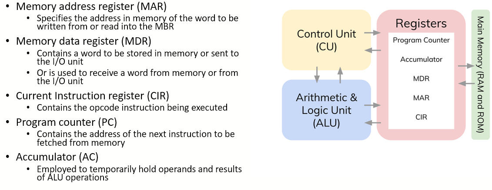  

### 3.2.3 Address（寻址)     
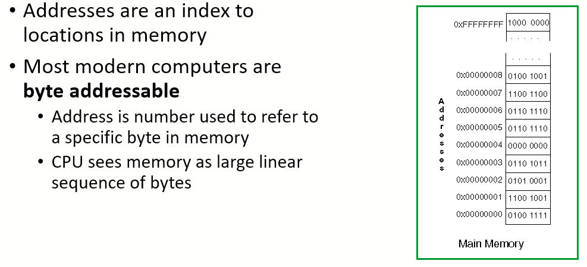  

### 3.2.4 Instructions
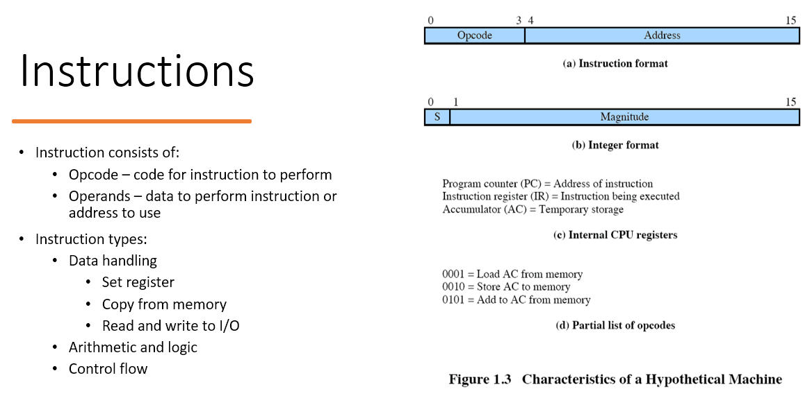  

### 3.2.5 Fetch-Decode-Execute Cycle
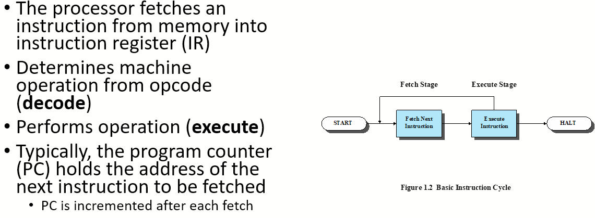  

### 3.2.6 Bottleneck(架构瓶颈)   

    • Von Neumann architectures shares memory bus for data and program instructions
    • Single bus limits throughput (data transfer rate) between CPU and memory （单总线限制了CPU和内存之间的吞吐量）
    • CPU must wait for data to be moved to or from memory （CPU必须等待数据移入或移出内存）

### 3.2.7 Bottleneck Mitigations(架构瓶颈缓解措施)

    • Cache between the CPU and the main memory;
        Stores instructions and data for future operations  

    • Separate caches or separate access paths for data and instructions (the so-called Modified Harvard architecture)        数据和指令的单独缓存或单独访问路径（所谓的改良哈佛架构） 

    • Using branch predictor algorithms and logic   
      (分支预测算法与逻辑)

    • On-chip scratchpad memory(片上暂存存储器) to reduce memory access  

    • Implementing the CPU and the memory as a system on chip
        Reduces latency

### 3.2.8 Harvard Architecture（哈佛架构)
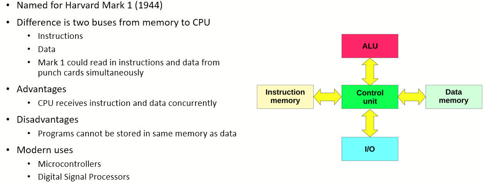

## 3.3 Transistor computer(电子管计算机：第二代计算机)

## 3.4 Integrated circuit computer(集成电路计算机：第三代计算机)